# A Survey on LoRA of Large Language Models [](https://awesome.re)

A curated list of papers and resources about LoRA of Large Language Models  based on our survey paper: [A Survey on LoRA of Large Language Models](https://arxiv.org/abs/2407.11046). 

**This repo will be continuously updated. Don't forget to star  it and keep tuned!**

**Please cite the paper in [Citations](#citations) if you find the resource helpful for your research. Thanks!**



## LoRA of LLMs

Low-Rank Adaptation(LoRA), which updates the dense neural network layers with pluggable low-rank matrices, is one of the best performed parameter efficient fine-tuning paradigms. Furthermore, it has significant advantages in cross-task generalization and privacy-preserving. Hence, LoRA has gained much attention recently, and the number of related literature demonstrates exponential growth. It is necessary to conduct a comprehensive overview of the current progress on LoRA. This survey categorizes and reviews the progress from the perspectives of (1) downstream adaptation improving variants that improve LoRA's performance on downstream tasks; (2) cross-task generalization methods that mix multiple LoRA plugins to achieve cross-task generalization; (3) efficiency-improving methods that boost the computation-efficiency of LoRA; (4) data privacy-preserving methods that use LoRA in federated learning; (5) application. Besides, this survey also discusses the future directions in this field.

## Contents

- [A Survey on LoRA of Large Language Models ](#a-survey-on-lora-of-large-language-models-)
  - [LoRA of LLMs](#lora-of-llms)
  - [Contents](#contents)
  - [Low-Rank Adaptation](#low-rank-adaptation)
    - [ Theoretical Analysis](#-theoretical-analysis)
    - [ Beyond Fine-tuning](#-beyond-fine-tuning)
  - [Downstream Adaptation Improving](#downstream-adaptation-improving)
    - [ Breaking the Low-rank Bottleneck](#-breaking-the-low-rank-bottleneck)
      - [Stacking LoRAs along Fine-tuning](#stacking-loras-along-fine-tuning)
      - [Updating as gradient compressor](#updating-as-gradient-compressor)
      - [Co-learning LLM and LoRA](#co-learning-llm-and-lora)
    - [ Dynamic Rank Allocation](#-dynamic-rank-allocation)
      - [SVD-Based Methods](#svd-based-methods)
      - [SRD-Based Methods](#srd-based-methods)
      - [Rank Sampling-Based Methods](#rank-sampling-based-methods)
    - [ Optimizing the Learning Procedure](#-optimizing-the-learning-procedure)
      - [Initialization Improvement](#initialization-improvement)
      - [Gradient Update Optimization](#gradient-update-optimization)
      - [Overfitting Mitigation](#overfitting-mitigation)
    - [ Combining with other Learning Paradigms](#-combining-with-other-learning-paradigms)
  - [Cross-task Generalization](#cross-task-generalization)
    - [ Mixture with Manually Designed Weights](#-mixture-with-manually-designed-weights)
    - [ Mixture with Learnt Weights](#-mixture-with-learnt-weights)
    - [ Mixture of LoRA Experts](#-mixture-of-lora-experts)
  - [Efficiency Improving](#efficiency-improving)
    - [ Parameter Reduction](#-parameter-reduction)
      - [Parameter Freezing](#parameter-freezing)
      - [Parameter Pruning](#parameter-pruning)
      - [Parameter Sharing](#parameter-sharing)
    - [ Parameter Quantization](#-parameter-quantization)
      - [PTQ-Based Methods](#ptq-based-methods)
      - [QAT-Based Methods](#qat-based-methods)
    - [ Parallel LoRA Computing Frameworks](#-parallel-lora-computing-frameworks)
      - [Parallel Fine-tuning](#parallel-fine-tuning)
      - [Parallel Inference](#parallel-inference)
  - [LoRA for Federated Learning](#lora-for-federated-learning)
    - [ Data Heterogeneity](#-data-heterogeneity)
    - [ Device Heterogeneity](#-device-heterogeneity)
    - [ Model Heterogeneity](#-model-heterogeneity)
    - [ Parameter Privacy](#-parameter-privacy)
  - [Applications of LoRA](#applications-of-lora)
    - [ Language Tasks](#-language-tasks)
    - [ Vision Tasks](#-vision-tasks)
    - [ Multimodal Tasks](#-multimodal-tasks)
  - [Contribution](#contribution)
  - [Citations](#citations)

## Low-Rank Adaptation

###  Theoretical Analysis
1. **A Kernel-Based View of Language Model Fine-Tuning.** `ICML 2023`
   
    *Malladi S., Wettig A., Yu D., Chen D., Arora S.* 2023

2. **The Impact of LoRA on the Emergence of Clusters in Transformers.** `preprint`
    *Koubbi H., Boussard M., Hernandez L.* 2024

3. **LoRA Training in the NTK Regime Has No Spurious Local Minima.** `preprint`
   
    *Jang U., Lee J. D., Ryu E. K.* 2024

4. **A Kernel-Based View of Language Model Fine-Tuning.** `ICML 2023`
     *Malladi S., Wettig A., Yu D., Chen D., Arora S.* 2023

5. **The Impact of LoRA on the Emergence of Clusters in Transformers.** `preprint`
   
     *Koubbi H., Boussard M., Hernandez L.* 2024

6. **LoRA Training in the NTK Regime Has No Spurious Local Minima.** `preprint`
   
     *Jang U., Lee J. D., Ryu E. K.* 2024

7. **Asymmetry in Low-Rank Adapters of Foundation Models.** `preprint`
     
     *Zhu J., Greenewald K. H., Nadjahi K., Ocáriz Borde d H. S., Gabrielsson R. B., Choshen L., Ghassemi M., Yurochkin M., Solomon J.* 2024

8. **The Expressive Power of Low-Rank Adaptation.** `preprint`
     
     *Zeng Y., Lee K.* 2023


###  Beyond Fine-tuning

1. **ReLoRA: High-rank training through low-rank updates.** `NeurIPS Workshop`. 
    
  *Lialin V, Muckatira S, Shivagunde N, Rumshisky A.* 2023

2. **MoRA: High-rank updating for parameter-efficient fine-tuning.** `preprint`

  *Jiang T, Huang S, Luo S, Zhang Z, Huang H, Wei F, Deng W, Sun F, Zhang Q, Wang D, others.* 2024

3. **Training neural networks from scratch with parallel low-rank adapters.** `preprint`

  *Huh M, Cheung B, Bernstein J, Isola P, Agrawal P.* 2024

4. **InfLoRA: Interference-free low-rank adaptation for continual learning.** `preprint`

   *Liang Y, Li W.* 2024
   
5. **GS-LoRA: Continual forgetting for pre-trained vision models.** `preprint`

   *Zhao H, Ni B, Wang H, Fan J, Zhu F, Wang Y, Chen Y, Meng G, Zhang Z.* 2024

6. **I-LoRA: Analyzing and reducing catastrophic forgetting in parameter-efficient tuning.** `preprint`

   *Ren W, Li X, Wang L, Zhao T, Qin W.* 2024

7. **LongLoRA: Efficient fine-tuning of long-context large language models.** `preprint`

   *Y. Chen, S. Qian, H. Tang, X. Lai, Z. Liu, S. Han, J. Jia.* 2023

8. **SinkLoRA: Enhanced efficiency and chat capabilities for long-context large language models.** `preprint`

   *Zhang H.* 2023

## Downstream Adaptation Improving

###  Breaking the Low-rank Bottleneck

#### Stacking LoRAs along Fine-tuning

<!-- 1. **样例Can Language Models Solve Graph Problems in Natural Language?** `preprint`

   *Heng Wang, Shangbin Feng, Tianxing He, Zhaoxuan Tan, Xiaochuang Han, Yulia Tsvetkov.* [[PDF](https://browse.arxiv.org/pdf/2305.10037.pdf)] [[Code](https://github.com/Arthur-Heng/NLGraph)], 2023.5,  

2. **样例Knowledge Graph Prompting for Multi-Document Question Answering.** `AAAI 2024`

   *Yu Wang, Nedim Lipka, Ryan Rossi, Alex Siu, Ruiyi Zhang, Tyler Derr.* [[PDF](https://arxiv.org/abs/2308.11730)] [[Code](https://github.com/YuWVandy/KG-LLM-MDQA)], 2023.8,  
 -->

1. **ReLoRA: High-Rank Training Through Low-Rank Updates.** `NeurIPS Workshop 2023`
   
   *Lialin V., Muckatira S., Shivagunde N., Rumshisky A. 2023*

2. **Chain of LoRA: Efficient fine-tuning of language models via residual learning.** `preprint`
   
   *Xia W, Qin C, Hazan E.* 2024

3. **Mini-ensemble low-rank adapters for parameter-efficient fine-tuning.** `preprint`
   
   *Ren P, Shi C, Wu S, Zhang M, Ren Z, Rijke d M, Chen Z, Pei J.* 2024

#### Updating as gradient compressor

1. **FLoRA: Low-rank adapters are secretly gradient compressors.** `preprint`
   
   *Hao Y, Cao Y, Mou L.* 2024

#### Co-learning LLM and LoRA

1. **Delta-LoRA: Fine-tuning high-rank parameters with the delta of low-rank matrices.** `preprint`
   
    *Zi B, Qi X, Wang L, Wang J, Wong K, Zhang L.* 2023

###  Dynamic Rank Allocation

#### SVD-Based Methods

1. **AdaLoRA: Adaptive Budget Allocation for Parameter-Efficient Fine-Tuning.** `ICLR 2023`
   
   *Zhang Q., Chen M., Bukharin A., He P., Cheng Y., Chen W., Zhao T. 2023*

2. **SaLoRA: Structure-aware low-rank adaptation for parameter-efficient fine-tuning.** `Mathematics`

    *Hu Y, Xie Y, Wang T, Chen M, Pan Z.* 2023

3. **IncreLoRA: Incremental Parameter Allocation Method for Parameter-Efficient Fine-Tuning.** `preprint`
   
   *Zhang F., Li L., Chen J., Jiang Z., Wang B., Qian Y. 2023*

#### SRD-Based Methods

1. **DoRA: Enhancing parameter-efficient fine-tuning with dynamic rank distribution.** `preprint`
 
    *Mao Y, Huang K, Guan C, Bao G, Mo F, Xu J.* 2024

2. **AutoLoRA: Automatically tuning matrix ranks in low-rank adaptation based on meta learning.** `preprint`

    *Zhang R, Qiang R, Somayajula S A, Xie P.* 2024

3. **SoRA: Sparse low-rank adaptation of pre-trained language models.** `EMNLP`

    *Ding N, Lv X, Wang Q, Chen Y, Zhou B, Liu Z, Sun M.* 2023

4. **ALoRA: Allocating low-rank adaptation for fine-tuning large language models.** `preprint`

    *Liu Z, Lyn J, Zhu W, Tian X, Graham Y.* 2024

#### Rank Sampling-Based Methods

1. **DyLoRA: Parameter-Efficient Tuning of Pre-trained Models Using Dynamic Search-Free Low-Rank Adaptation.** `EACL 2023`
    
   *Valipour M., Rezagholizadeh M., Kobyzev I., Ghodsi A. 2023*

###  Optimizing the Learning Procedure

#### Initialization Improvement

1. **The impact of initialization on LoRA finetuning dynamics.** `preprint`
   
   *Hayou S, Ghosh N, Yu B.* 2024

2. **PISSA: Principal singular values and singular vectors adaptation of large language models.** `preprint`

   *Meng F, Wang Z, Zhang M.* 2024

4. **MiLoRA: Harnessing minor singular components for parameter-efficient LLM finetuning.** `preprint`

   *Wang H, Xiao Z, Li Y, Wang S, Chen G, Chen Y.* 2024

#### Gradient Update Optimization

1. **Riemannian preconditioned LoRA for fine-tuning foundation models.** `preprint`

   *Zhang F, Pilanci M.* 2024

2. **LoRA+: Efficient low rank adaptation of large models.** `preprint`

   *Hayou S, Ghosh N, Yu B.* 2024

3. **ResLoRA: Identity residual mapping in low-rank adaption.** `preprint`
    
   *Shi S, Huang S, Song M, Li Z, Zhang Z, Huang H, Wei F, Deng W, Sun F, Zhang Q.* 2024

4. **SIBO: A simple booster for parameter-efficient fine-tuning.** `preprint`

   *Wen Z, Zhang J, Fang Y.* 2024

#### Overfitting Mitigation

1. **BiLoRA: A bi-level optimization framework for overfitting-resilient low-rank adaptation of large pre-trained models.** `preprint`

   *Qiang R, Zhang R, Xie P.* 2024

2. **LoRA dropout as a sparsity regularizer for overfitting control.** `preprint`

   *Lin Y, Ma X, Chu X, Jin Y, Yang Z, Wang Y, Mei H.* 2024

3. **LoRA meets dropout under a unified framework.** `preprint`

   *Wang S, Chen L, Jiang J, Xue B, Kong L, Wu C.* 2024

###  Combining with other Learning Paradigms

1. **Laplace-LoRA: Bayesian low-rank adaptation for large language models.** `preprint`

   *Yang A X, Robeyns M, Wang X, Aitchison L.* 2023

2. **PILLOW: Enhancing efficient instruction fine-tuning via prompt matching.** `EMNLP`

   *Qi Z, Tan X, Shi S, Qu C, Xu Y, Qi Y.* 2023

3. **STAR: Constraint LoRA with dynamic active learning for data-efficient fine-tuning of large language models.** `preprint`

   *Zhang L, Wu J, Zhou D, Xu G.* 2024

## Cross-task Generalization

###  Mixture with Manually Designed Weights

1. **LoRA Ensembles for large language model fine-tuning.** `preprint`

   *Wang X, Aitchison L, Rudolph M.* 2023

2. **LoRAretriever: Input-aware LoRA retrieval and composition for mixed tasks in the wild.** `preprint`

   *Zhao Z, Gan L, Wang G, Zhou W, Yang H, Kuang K, Wu F.* 2024

3. **Token-level adaptation of LoRA adapters for downstream task generalization.** `AICCC`

   *Belofsky J.* 2023

4. **Effective and parameter-efficient reusing fine-tuned models.** `preprint`

   *Jiang W, Lin B, Shi H, Zhang Y, Li Z, Kwok J T.* 2023

5. **Composing parameter-efficient modules with arithmetic operations.**  `preprint`
   
    *Zhang J, Chen S, Liu J, He J.* 2023

6. **Task arithmetic with LoRA for continual learning.** `preprint`

    *Chitale R, Vaidya A, Kane A, Ghotkar A.* 2023    

###  Mixture with Learnt Weights

1. **LoRAHub: Efficient cross-task generalization via dynamic LoRA composition.** `preprint`

   *Huang C, Liu Q, Lin B Y, Pang T, Du C, Lin M.* 2023

2. **ComPEFT: Compression for communicating parameter efficient updates via sparsification and quantization.** `preprint`

   *Yadav P, Choshen L, Raffel C, Bansal M.* 2023

3. **L-LoRA: Parameter efficient multi-task model fusion with partial linearization.** `preprint`

   *Tang A, Shen L, Luo Y, Zhan Y, Hu H, Du B, Chen Y, Tao D.* 2023

4. **MixLoRA: Multimodal instruction tuning with conditional mixture of LoRA.** `preprint`

   *Shen Y, Xu Z, Wang Q, Cheng Y, Yin W, Huang L.* 2024

5. **X-LoRA: Mixture of low-rank adapter experts, a flexible framework for large language models with applications in protein mechanics and design.** `preprint`

   *Buehler E L, Buehler M J.* 2024

###  Mixture of LoRA Experts

1. **MoRAL: MoE augmented LoRA for LLMs’ lifelong learning.** `preprint`

   *Yang S, Ali M A, Wang C, Hu L, Wang D.* 2024

2. **LoRAMoE: Alleviate world knowledge forgetting in large language models via MoE-style plugin.** `preprint`

   *Dou S, Zhou E, Liu Y, Gao S, Zhao J, Shen W, Zhou Y, Xi Z, Wang X, Fan X, Pu S, Zhu J, Zheng R, Gui T, Zhang Q, Huang X.* 2023

3. **MoCLE: Mixture of cluster-conditional LoRA experts for vision-language instruction tuning.** `preprint`

   *Gou Y, Liu Z, Chen K, Hong L, Xu H, Li A, Yeung D, Kwok J T, Zhang Y.* 2023

4. **MOELoRA: An MoE-based parameter efficient fine-tuning method for multi-task medical applications.** `preprint`

   *Liu Q, Wu X, Zhao X, Zhu Y, Xu D, Tian F, Zheng Y.* 2023

5. **Mixture-of-LoRAs: An efficient multitask tuning method for large language models.** `LREC/COLING`

   *Feng W, Hao C, Zhang Y, Han Y, Wang H.* 2024

6. **MultiLoRA: Democratizing LoRA for better multi-task learning.** `preprint`

   *Wang Y, Lin Y, Zeng X, Zhang G.* 2023

7. **MLoRE: Multi-task dense prediction via mixture of low-rank experts.** `preprint`

   *Yang Y, Jiang P, Hou Q, Zhang H, Chen J, Li B.* 2024

8. **MTLoRA: Low-rank adaptation approach for efficient multi-task learning.** `CVPR`

   *Agiza A R SN. M.* 2024

9. **MoLA: Higher layers need more LoRA experts.** `preprint`

   *Gao C, Chen K, Rao J, Sun B, Liu R, Peng D, Zhang Y, Guo X, Yang J, Subrahmanian V S.* 2024

10. **LLaVA-MoLE: Sparse mixture of LoRA experts for mitigating data conflicts in instruction finetuning MLLMs.** `preprint`
    *Chen S, Jie Z, Ma L.* 2024

11. **SiRA: Sparse mixture of low rank adaptation.** `preprint`

    *Zhu Y, Wichers N, Lin C, Wang X, Chen T, Shu L, Lu H, Liu C, Luo L, Chen J, Meng L.* 2023

    ...


## Efficiency Improving

###  Parameter Reduction

#### Parameter Freezing
- **LoRA-SP: Streamlined Partial Parameter Adaptation for Resource Efficient Fine-Tuning of Large Language Models** `arXiv`  
  *Y. Wu, Y. Xiang, S. Huo, Y. Gong, P. Liang*. 2024
- **LoRA-FA: Memory-Efficient Low-Rank Adaptation for Large Language Models Fine-Tuning** `arXiv`  
  *L. Zhang, L. Zhang, S. Shi, X. Chu, B. Li*. 2023
- **AFLoRA: Adaptive Freezing of Low Rank Adaptation in Parameter Efficient Fine-Tuning of Large Models** `arXiv`  
  *Z. Liu, S. Kundu, A. Li, J. Wan, L. Jiang, P. A. Beerel*. 2024
- **DropBP: Accelerating Fine-Tuning of Large Language Models by Dropping Backward Propagation** `arXiv`  
  *S. Woo, B. Park, B. Kim, M. Jo, S. Kwon, D. Jeon, D. Lee*. 2024
- **LoRA-XS: Low-Rank Adaptation with Extremely Small Number of Parameters** `arXiv`  
  *K. Bałazy, M. Banaei, K. Aberer, J. Tabor*. 2024
- **BYOM-LoRA: Effective and Parameter-Efficient Reusing Fine-Tuned Models** `arXiv`  
  *W. Jiang, B. Lin, H. Shi, Y. Zhang, Z. Li, J. T. Kwok*. 2023

#### Parameter Pruning
- **LoRA-Drop: Efficient LoRA Parameter Pruning Based on Output Evaluation** `arXiv`  
  *H. Zhou, X. Lu, W. Xu, C. Zhu, T. Zhao*. 2024
- **LoRAPrune: Pruning Meets Low-Rank Parameter-Efficient Fine-Tuning** `arXiv`  
  *M. Zhang, H. Chen, C. Shen, Z. Yang, L. Ou, X. Zhuang, B. Zhu*. 2023
- **LoRAShear: Efficient Large Language Model Structured Pruning and Knowledge Recovery** `arXiv`  
  *T. Chen, T. Ding, B. Yadav, I. Zharkov, L. Liang*. 2023
- **Parameter-Efficient Fine-Tuning with Layer Pruning on Free-Text Sequence-to-Sequence Modeling** `arXiv`  
  *Y. Zhu, X. Yang, Y. Wu, W. Zhang*. 2023

#### Parameter Sharing
- **VeRA: Vector-Based Random Matrix Adaptation** `arXiv`  
  *D. J. Kopiczko, T. Blankevoort, Y. M. Asano*. 2023
- **VB-LoRA: Extreme Parameter Efficient Fine-Tuning with Vector Banks** `arXiv`  
  *Y. Li, S. Han, S. Ji*. 2024
- **Parameter-Efficient Fine-Tuning with Discrete Fourier Transform** `arXiv`  
  *Z. Gao, Q. Wang, A. Chen, Z. Liu, B. Wu, L. Chen, J. Li*. 2024

###  Parameter Quantization

#### PTQ-Based Methods
- **QLoRA: Efficient Fine-Tuning of Quantized LLMs** `NeurIPS`  
  *T. Dettmers, A. Pagnoni, A. Holtzman, L. Zettlemoyer*. 2024
- **QA-LoRA: Quantization-Aware Low-Rank Adaptation of Large Language Models** `arXiv`  
  *Y. Xu, L. Xie, X. Gu, X. Chen, H. Chang, H. Zhang, Z. Chen, X. Zhang, Q. Tian*. 2023

#### QAT-Based Methods
- **LoftQ: LoRA-Fine-Tuning-Aware Quantization for Large Language Models** `arXiv`  
  *Y. Li, Y. Yu, C. Liang, P. He, N. Karampatziakis, W. Chen, T. Zhao*. 2023
- **ApiQ: Finetuning of 2-Bit Quantized Large Language Model** `arXiv`  
  *B. Liao, C. Monz*. 2024
- **L4Q: Parameter Efficient Quantization-Aware Training on Large Language Models via LoRA-Wise LSQ** `arXiv`  
  *H. Jeon, Y. Kim, J. Kim*. 2024

###  Parallel LoRA Computing Frameworks

#### Parallel Fine-tuning
- **ASPEN: High-Throughput LoRA Fine-Tuning of Large Language Models with a Single GPU** `arXiv`  
  *Z. Ye, D. Li, J. Tian, T. Lan, J. Zuo, L. Duan, Y. Jiang, J. Sha, K. Zhang, M. Tang*. 2023

#### Parallel Inference
- **Punica: Multi-Tenant LoRA Serving** `MLSys`  
  *L. Chen, Z. Ye, Y. Wu, D. Zhuo, L. Ceze, A. Krishnamurthy*. 2024
- **S-LoRA: Serving Thousands of Concurrent LoRA Adapters** `arXiv`  
  *Y. Sheng, S. Cao, D. Li, C. Hooper, N. Lee, S. Yang, C.-C. Chou, B. Zheng, K. Keutzer*. 2023
- **CARASERVE: CPU-Assisted and Rank-Aware LoRA Serving for Generative LLM Inference** `arXiv`  
  *S. Li, H. Lu, T. Wu, M. Yu, Q. Weng, X. Chen, Y. Shan, B. Yuan, W. Wang*. 2024


## LoRA for Federated Learning

###  Data Heterogeneity


###  Device Heterogeneity


###  Model Heterogeneity


###  Parameter Privacy


## Applications of LoRA

###  Language Tasks


###  Vision Tasks


###  Multimodal Tasks


## Contribution

Contributions to this repository are welcome!

If you find any error or have relevant resources, feel free to open an issue or a pull request.

Paper format:

```
1. **[paper title].** `[]`

    *[authors].* [[PDF]([pdf link])] [[Code]([code link])], published time,  
```

## Citations

Please cite the following paper if you find the resource helpful for your research.

```
@article{,
  title={A Survey on LoRA of Large Language Models},
  author={},
  journal={arXiv preprint arXiv:2407.11046},
  year={2024}
}
```


Thank you for your support!
